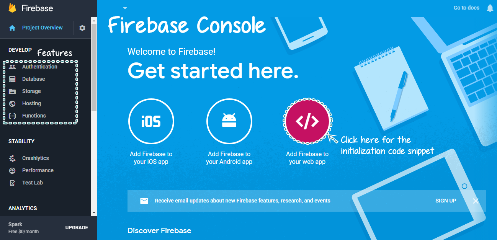
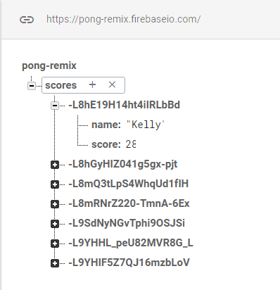

# Entry 2: Saving and Retrieving Data 
Ok, the topic of my independent study is Firebase, but now what? First, I start looking through the [Firebase website](https://firebase.google.com) to find tutorials explains how to add Firebase to a javascript project. While looking at one of the tutorials, all I see was a bunch of words with code snippets that I don't understand, so I went straight to the video they provided because I learn better visually rather than just reading chunks of words.

### Installing Firebase on a Web App
1. Open up the Javascript app that you want to add Firebase to
2. Open the [Firebase console](https://console.firebase.google.com/u/0/) and click on *Add Project*
3. Click on *Add Firebase to your web app*

4. In order to reference to the Firebase library, copy and paste the following code snippet into the ``` <head> </head> ```tags

    ``` <script src="https://www.gstatic.com/firebasejs/4.12.1/firebase.js"></script> ```
5. Copy and paste the following code snippet inside of the ``` function setup(){ } ```

```  
  // Initialize Firebase
  // TODO: Replace with your project's customized code snippet
  var config = {
    apiKey: "<API_KEY>",
    authDomain: "<PROJECT_ID>.firebaseapp.com",
    databaseURL: "https://<DATABASE_NAME>.firebaseio.com",
    storageBucket: "<BUCKET>.appspot.com",
    messagingSenderId: "<SENDER_ID>",
  };
  firebase.initializeApp(config);
   ```
* Hmmm... This looks familiar, didn't some of the APIs required an API Key when we created an app using an API for our final project in the sinatra unit. We even had a whole lesson on how to hide the API key.

---
To practice installing Firebase, I opened up my Pong remix project from 2 years ago when we learned about p5js/processing and look through my commented code to remind myself what this project does as I add Firebase to the project. So now I know how to install Firebase, what's next? I look through the features that I can include in my project. Not knowing where to start, my classmate suggested a Youtube tutorial by Daniel Shiffman that explains how to save and retrieve data using Firebase. Using this tutorial, I wanted to try to accomplish my next steps by creating a leaderboard that displays the user's scores.

### Saving Data
* To save the user's score in the firebase database, I created a variable called database that connects to my online Firebase database.

    ``` var database = firebase.database(); ```

* To create a **path** that would send the user's scores to the Firebase database, I have to create a reference variable to access the database structure. **Scores** is the reference where each entry is the user's ID, which contains the user's name and score.

    ``` var ref = database.ref('scores'); ```
    
* To take in the name and score from the user, I created an input box and a submit button.
    * This was where I was stuck because I didn't link **p5.dom library**.
    ```
            username = createInput();
            submit = createButton("Submit");
            submit.mousePressed(submitScore); //when clicked, score + name is pushed to database
    ```
* To collect data from the user, I created an object that saves the user's name and score inside my ```submitScore()``` function.

    * To add data to the Firebase database, I looked back at my previous notes and used the ```push()``` function.
``` 
function submitScore() {
            var data = {
                name: username.value(),
                score: scoreNum
            }
            var ref = database.ref('scores').push(data);
        }
```
#### End Result:


#### My Notices from the tutorial
* Database is organized in a tree-like structure, which reminds me of when we first learn about git repository structure. In a git repository, we start with the workspace(in this case the score) and inside the workspace, we can create directories(user id) and each directory can store files (name + score).
---
## Retrieving Data
* To ask Firebase for the data that was saved, a **callback**(```.on()```) is assigned to return all the data from a certain path, in this case, the scores and another callback that returns the errors.
 
    ```ref.on('value', gotData, errorData)```
    * In the ```gotData``` callback function, it displays an object containing keys(or ID) and each key is bound to an object with the username and score. Then the function iterates over the keys and displays the username and score in a list.
    ``` function gotData(data){
                var scorelistings = selectAll('.scorelisting');
                for (var i=0; i < scorelistings.length; i++){//select + get an array
                    scorelistings[i].remove(); //gets rid of repetitive previous scores
                }
                var scores = data.val();
                var keys = Object.keys(scores);
                console.log(keys); //return an array with the keys/id
                for (var i=0; i < keys.length; i++){ //iterates over the keys
                    var k = keys[i];
                    var name = scores[k].name;
                    var score = scores[k].score;
                    // console.log(name,score)
                    var li = createElement('li', name + ': ' + score);
                    li.class('scorelisting');
                    li.parent('scorelist');
                    
                }
            }
    ```
    * The ```errorData``` simply alerts you in the console when there's an error in the data
    ```
    function errorData(error){
                console.log("Error!");
                console.log(error);
            }
    ```
    **Notes to self:** Right click + inspect to preview console.log
---
 [**Link to the project**](https://preview.c9users.io/zhiyinl5633/firebase/testing/pong.html?_c9_id=livepreview0&_c9_host=https://ide.c9.io) I tested on (sorry that it's poorly formatted)


---
## Takeaways
* If you're more of a visual person like me, **try looking for alternative methods**, such as videos, to help you better understand a new topic.
* **Connect the present to the past to look for similarities.** Just like how installing Firebase is similar to using an API that requires authentication and how the database structure is similar to the git repository structure.
* **Commenting your code will make it a lot easier for the future you to understand.** If I didn't comment my code back then, I wouldn't have remembered what I did 2 years ago. Thanks, Mr.Mueller for telling us to do this.

## Resources
* [Firebase Setup](https://firebase.google.com/docs/web/setup)
* [Saving Data Tutorial](https://www.youtube.com/watch?v=7lEU1UEw3YI)
* [Retrieving Data Tutorial](https://www.youtube.com/watch?v=NcewaPfFR6Y)

[Next](entry3.md)

[Table of Contents](../README.md)