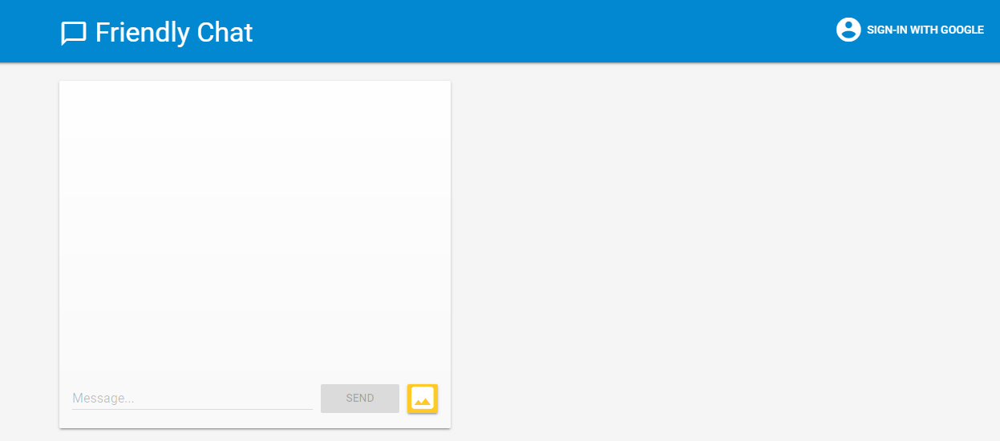

# Entry 3: Friendly Web Chat
Wow, we are already 1/3 way to the 9 weeks of our independent study, choosing a topic seems like it was just yesterday. *So what am I doing this week?* Well, I didn't really have a plan like I was supposed to, but I talked with my classmates who are also studying Firebase and we decided to build our own web chat app and help each other out along the way. In the [Firebase website](https://firebase.google.com), we found a Friendly Chat Codelab that provides a detailed explanation and step-by-step instructions on how to use Firebase to build a chat app. 

### Access to the Friendly Chat Codelab
1. Go to the [Firebase website](https://firebase.google.com)
2. Scroll all the way down and click on [Samples](https://firebase.google.com/docs/samples/) in the first column on the left
3. Scroll down until you see the word Codelabs
4. Click on the ```</>``` icon on the right to access the [web version of the app](https://codelabs.developers.google.com/codelabs/firebase-web/#0 )


---
**FYI:** In the learning folder of this repository, I created a friendlychat-web folder, which stores the chat app that I code along as I follow the instructions on the Friendly Chat Codelab. Ok, now back to what I learned from the codelab.

### Installing the Firebase **Command Line Interface(CLI)** 
First of all, *What is CLI?* Well, CLI allows you to locally store your web app and deploy your web app to Firebase hosting.
1. To install CLI, run the following npm command
```npm -g install firebase-tools```
2. To verify CLI installation, run the following command in the command line:
```firebase --version //should be 3.18.2 or above```
3. To authorize the Firebase CLI, run the following command in the command line
```firebase login```
4. Make sure that you are in the web-start directory and run the following command to setup the Firebase CLI
```firebase use --add```
* **Challenges:** 

    

    * At first when I tried running this command, I clicked on the long URL to log in and I ended up receiving an error. When I saw that blue link, I thought *blue means to click*, so I clicked on the **localhost 9005** link and it directed me to google. So I clicked on the first result and it brought me to a slackoverflow question. The post only has 1 answer with 31 up arrows and big green check, meaning that it is reliable. 
        
        

        So, I went back to my command line and run the **firebase login --no-localhost** command, select account, copy and paste the authorization code, and **TADA!!!**, I was logged in.
    * *Right after I killed a bug, another one came. Sigh...* Now this time, the ```firebase serve``` command (runs the app) is not working. With the help of my classmates, I learned that I have to authenticate c9 on the [Firebase console](https://console.firebase.google.com/u/0/).

### Authenticate C9 on Firebase Console
1. In C9, click on the main.js file, press run(green button) at the top, and copy the URL that your code is running at
2. Go to the [Firebase console](https://console.firebase.google.com/u/0/) and click on **Authentication** on the left and click on the **SIGN-IN METHOD** tab


2. Scroll down, click on **ADD DOMAIN**, and paste the URL that you previously copied as the domain
4. Go back to C9, and run the command ```firebase serve -p $PORT -o $IP``` (*Hmmm... don't this look familiar*) in the command line 

### Next Steps
* Figure out how to show notifications on the web chat
* Deploy the web chat app
---

### Firebase Database feature
*Want to see something very cool?* All the messages are stored in the Firebase Database.


[Click here to test out the web chat that I built ](http://firebase-zhiyinl5633.c9users.io:8080/)
Note: Currently, the app only works when I run it on the command line

Here's how the web chat looks:

---
## Takeaways
* **Work together.** Exploring a new topic on our own can be extremely difficult. So, gather with people who are studying the same topic as you and help each other out because they may be struggling with the same challenges that you have encountered. 
* **Not everything works the way we wanted.** We don't often get our code to run the way we wanted. In the process, we will always encounter some nasty looking bugs(not literally, I'm sure you know what I mean). In order to get rid of that nasty bug, we have to go back, look over the code, test things out, comment things out, and ask our BFF, Google, for help. 

## Resources
* https://codelabs.developers.google.com/codelabs/firebase-web/#0

[Next](entry4.md)

[Table of Contents](../README.md)


