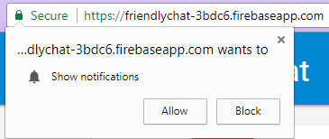
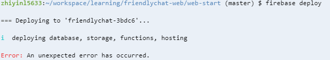
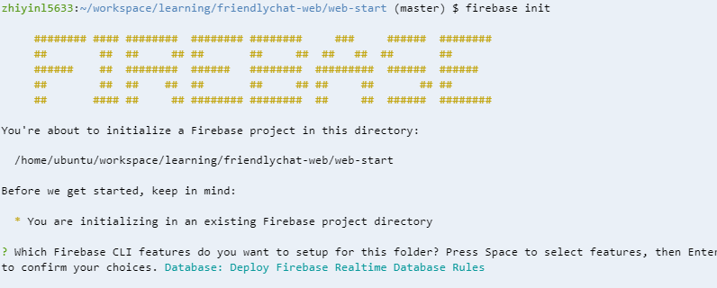
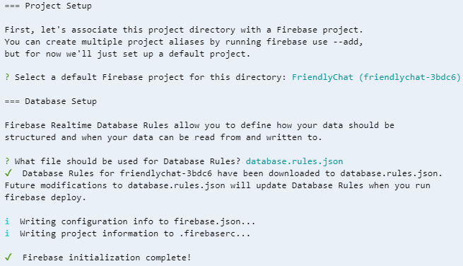
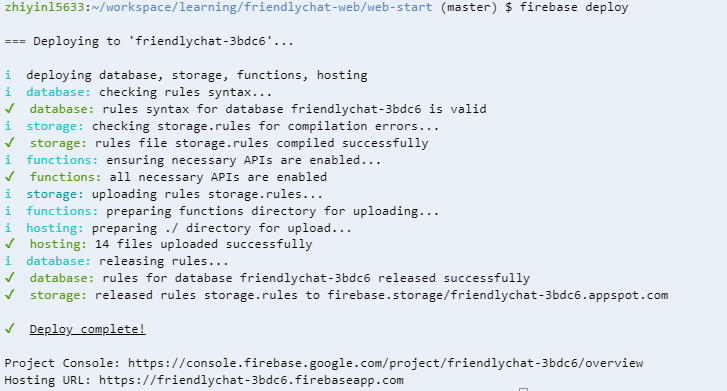

# Entry 4: Friendly Web Chat (Cont.)
For week 4, since I didn't really have a plan of starting something new, I decided to work on my web chat from last week and try to accomplish the next steps. A challenge that I overcome while building the web chat was getting the notifications to show on the web chat. I looked over the instructions on the [Friendlychat Codelab](https://codelabs.developers.google.com/codelabs/firebase-web/#0) and make sure that I didn't miss any steps. 

### Show Notifications
To deliver messages and notifications with no charge, you can implement **Firebase Cloud Messaging (FCM)**, a cross-platform messaging solution, in your application. Basically, like most of the social media apps, you receive a notification every time there's new posts, messages, updates, and etc.  
1. For sending messages from one user to another, you have to specify the ```gcm_sender_id```, which indicates that FMC is authorized to send messages to your app.
The following snippet is the sender ID:
``` javascript
{
  "name": "Friendly Chat",
  "short_name": "Friendly Chat",
  "start_url": "/index.html",
  "display": "standalone",
  "orientation": "portrait",
  "gcm_sender_id": "103953800507"
}
```

2. To receive and display notifications, a **service worker** is needed, which acts like as proxy servers that sit between web applications, the browser, and the network. Basically, it loads and initializes the Firebase Cloud Messaging.
```javascript
importScripts('/__/firebase/3.8.0/firebase-app.js');
importScripts('/__/firebase/3.8.0/firebase-messaging.js');
importScripts('/__/firebase/init.js');

firebase.messaging();
```

3. **Remember to enable notifications on the browser in school.** Once the notification is enabled, you will receive a **device token**, which is used to send a notification to a particular device.
A snippet of the ```FriendlyChat.prototype.saveMessagingDeviceToken``` function:
```javascript
// Saves the messaging device token to the datastore.
FriendlyChat.prototype.saveMessagingDeviceToken = function() {
  firebase.messaging().getToken().then(function(currentToken) {
    if (currentToken) {
      console.log('Got FCM device token:', currentToken);
      // Saving the Device Token to the datastore.
      firebase.database().ref('/fcmTokens').child(currentToken)
          .set(firebase.auth().currentUser.uid);
    } else {
      // Need to request permissions to show notifications.
      this.requestNotificationsPermissions();
    }
  }.bind(this)).catch(function(error){
    console.error('Unable to get messaging token.', error);
  });
};
```
**However, this does not work until the user grant your app the permission to receive notifications.**

I tried getting the notification to show by enabling the notifications in the school's browser, but nothing showed up. Since I know that in school's browsers, some of the access is denied, so I decided to try again at home on my own laptop and I was able to get it to pop up.



Since we are used to using the incognito window in school, it was hard to realize that the window was the cause of the problem at first.

Note to Self: **NOTIFICATIONS DOES NOT SHOW ON INCOGNITO!** 
---
### Last Step, Deploying
In the beginning, when I shared the URL to my project, the link only runs when I run my app on the command line using the ```firebase serve -p $PORT -i $IP``` command. Now, the URL is accessible to everyone without having to run the app on the command line.
#### How to Deploy?
1. Before deploying, you have to specify which file you are deploying with the Firebase CLI through the following snippet:
```javascript
{
  // If you went through the "Realtime Database Security Rules" step.
  "database": {
    "rules": "database-rules.json"
  },
  // If you went through the "Storage Security Rules" step.
  "storage": {
    "rules": "storage.rules"
  },
  "hosting": {
    "public": "./",
    "ignore": [
      "firebase.json",
      "database-rules.json",
      "storage.rules"
    ]
  }
}
```
* ```"public": "./"``` means to deploy all files in the current directory.
* The files inside the ``` "ignore":``` array is being ignored.

2. Deploy your files to firebase by running the ```firebase deploy``` command.
**Challenges:** When I first deploy my files, I came across an error.



I tried googling the error, but I couldn't find responses that relate to my situation.
When I told my classmate about the error, he reminded me that I have to initialize firebase. Since at one point I restarted my entire project, I may have skipped a step. When I run the ```firebase init``` command, and received this:





After initializing firebase, I tried the ```firebase deploy``` command and my app was successfully deployed.



### **Link to the project:**
https://friendlychat-3bdc6.firebaseapp.com/
---
## Takeaways
* **Try out different windows.** While coding, you may encounter situations where the code does not work on a certain window, like incognito, while it works on the regular window.
* **Asking classmates for help.** It is very important to ask your classmates for help when you are stuck because they may have encountered the same error as you. 
---
[Next](entry5.md)

[Previous](entry3.md)

[Table of Contents](../README.md)