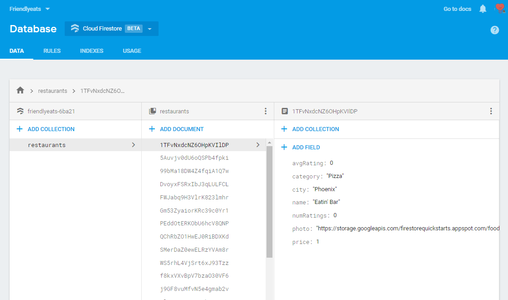
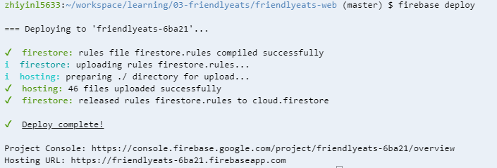

# Entry 5: Friendly Eats
At the beginning of week 5, I was about to try working with APIs using Javascript through following [Daniel Shiffman's Youtube tuorial](https://www.youtube.com/watch?v=ecT42O6I_WI). However, as I follow through the video and tinkering with my previous API, Tvmaze, I felt like it was difficult for me to understand in a short week. I decided to move on from this idea, maybe I'll get back to this next time, and find something that I am comfortable learning. After browsing through the [Firebase website](https://firebase.google.com), I found another codelab called [Firestore Web Codelab](https://codelabs.developers.google.com/codelabs/firestore-web/#0) and decide to give it a try. 

### Important Commands
* ```npm install -g firebase-tools```: installs the latest version of Firebase CLI(explained in entry 3).
* ```firebase use --add```: apply Firebase CLI to the app.
* ```firebase open auth```: returns a link directed to the Authentication Providers configuration page.
* ```firebase serve```: runs the local server.
    * **AH HA!** This command appeared again. Rather than following this command that will eventually return an error, I used the command ```firebase serve -p $PORT -o $IP``` that I learned from my previous entries.

---
### Writing data to Firestore
**Note:** Firestore data is split into documents, collections, and subcollections
* In this codelab, each restaurant is stored as a document in a collection called "restaurants". 
* The following snippet adds a new document to the "restaurants collection"
    * Challenges: At one point of the codelab, I was unable to make the new entries in the restaurant collection to appear. I ended up having to restart the codelab and that's when I finally realized that I messed up when replacing the function ```FriendlyEats.prototype.addRestaurant``` with the following snippet. I paste the snippet into the function rather than replacing the function with the snippet.

```javascript
FriendlyEats.prototype.addRestaurant = function(data) {
  var collection = firebase.firestore().collection('restaurants');
  return collection.add(data);
};
```



After following all the steps in the codelab, I deployed the app using ```firebase deploy```(even though it was not mentioned in the codelab) and got the link that is accessible to everyone.



---
### **Link to the project:**
https://friendlyeats-6ba21.firebaseapp.com/
---
### Next Steps:
* Figure out what to do for the final project and start planning(**only 4 weeks left!!!**).
---
## Takeaways
* **Read instructions more carefully.** In this codelab, I ended up restarting the entire codelab because I paste a snippet of code inside a function rather than replacing the function with the snippet. This is what I get for not reading carefully. 
* **Apply what you previously learned to your current project.** Every time you learn something new, you will eventually be able to use it in your new projects. Just like how I got the ```firebase deploy``` and ```firebase serve -p $PORT -o $IP``` command from previous entries and applied it on here.
---
[Next](entry6.md)

[Previous](entry4.md)

[Table of Contents](../README.md)